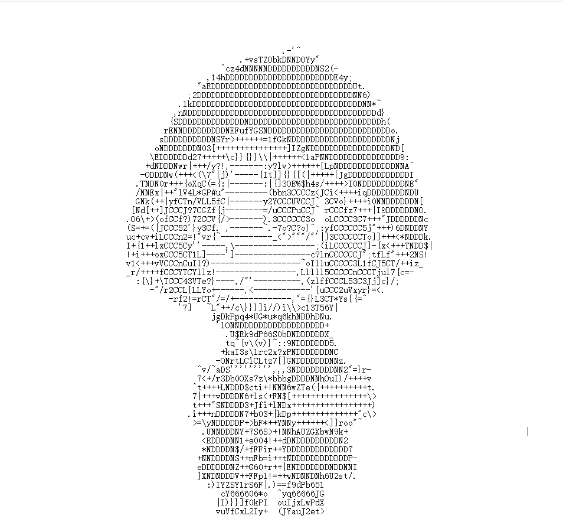

# Ascii-Generator

所有可见字符的灰度值排序是

~~~
M@HW&QBm#R%K8$NDEhgk9dPSb60pFOXwAqGUZ4*n5auYJ2TVf3LCx?zIselojy1rit!()v7[]c\}{=/"<>|+:~;',-_^. 
~~~

目前的算法：

- 把图片分成10*5的小块儿
- 每块儿求出平均灰度值，将这个[0,255]的灰度值映射到94个可见字符上

效果图：

还是可以的...\_(:з」∠)\_
