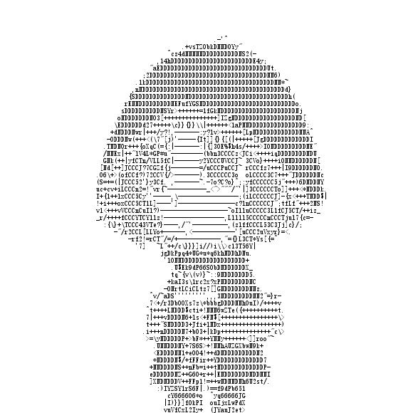
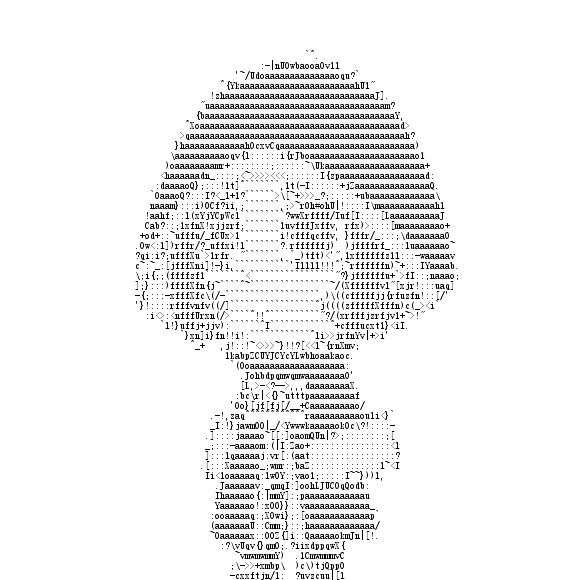
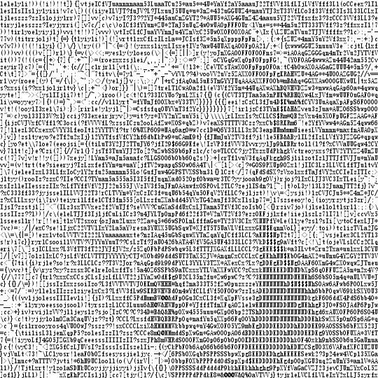

# Ascii-Generator

所有可见字符的灰度值排序是(自己算的)

~~~
M@HW&QBm#R%K8$NDEhgk9dPSb60pFOXwAqGUZ4*n5auYJ2TVf3LCx?zIselojy1rit!()v7[]c\}{=/"<>|+:~;',-_^. 
~~~

[Character representation of grey scale images](http://paulbourke.net/dataformats/asciiart/)中给出的是：

~~~
$@B%8&WM#*oahkbdpqwmZO0QLCJUYXzcvunxrjft/\|()1{}[]?-_+~<>i!lI;:,"^`'. 
~~~

目前的算法：

- 把图片分成10*5的小块儿
- 每块儿求出平均灰度值，将这个[0,255]的灰度值映射到94个可见字符上

效果图：

还是可以的...\_(:з」∠)\_  

使用网站里给的灰度值效果是：

感觉还是字符集多一点相对好些？

但是由于算法本身是基于灰度值的，所以如果背景颜色很多，大概难以区分。就像某copyright的头像，不过好像隐约可以看出轮廓？~~可以借此隐藏一些信息?~~

